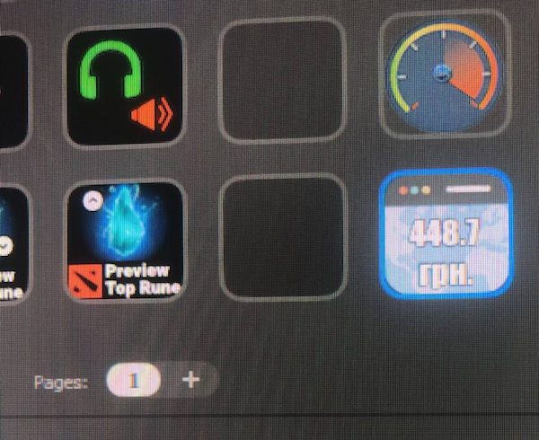

# Browser Actions Automation in one request for [Elgato Stream Deck](https://www.elgato.com/en/stream-deck-mk2)

This aproach allows you to automate browser actions such as going to a specific URL, logging into an account, extracting data, and than displaying them on the Stream Deck button. 



## Pre-requisites
- Solution is based on API Ninja plugin from [BarRiders](https://barraider.com/#plugins)
- It is completely free, but requires an API key from [PhantomJS Cloud](https://phantomjscloud.com) (600 requests per day are free).

## Usage
1. Register for a free account at https://phantomjscloud.com/ and get your API key. 
2. Construct a POST request to https://phantomjscloud.com/api/browser/v2/API_KEY_HERE/ and pass in the following body:

```
{
  "url": "https://{YOUR ENTRY URL HERE}",
  "renderType": "automation",
  "overseerScript":"{PUPPETEER CODE SCRIPT}"
}
```

3. Debug your request in [Postman](https://www.postman.com/) or to view results. 
ex: 
- set "renderType": "png" to return image result 
- or add "outputAsJson": true to see detailed steps from PhantomJS Cloud in debug mode

### Example

You can download sample API Ninja settings file [here](settings.ninja)

In the provided example, the script logs into an account, awaits for some HTML element to make sure the page has loaded, inputs the credentials, submits the form, awaits 1s for navigation, extracts some data from h1 tag, and sets it to metadata (which will be available in the response JSON) by the path `storage.{YOUR_DATA_KEY}`


```
{
  "url": "https://{YOUR ENTRY URL HERE}",
  "renderType": "automation",
  "overseerScript":"
     let _user='{LOGIN_HERE}'; 
     let _pass='{PASSS_HERE}'; 
     await page.waitForSelector('input[name=username]'); 
     await page.type('input[name=username]',_user); 
     await page.type('input[name=password]',_pass); 
     await page.click('input[type=submit]'); 
     await page.waitForDelay(1000); 
     await page.meta.store.set(
        '{YOUR_DATA_KEY}', 
        await page.content({selector:'#main .user_data h1', type:'plainText'}) 
     );
   "
}
```

In this case, it is used to login to an ISP, extract the remaining balance and show it on a button.

## Additional Comments
- Make sure to replace `API_KEY_HERE` and other placeholders in the body with your actual values.
- Make sure to replace `YOUR ENTRY URL HERE` with your entry point URL
- Make sure to replace `PUPPETEER CODE SCRIPT` with your javascript code that works on [Puppeteer](https://github.com/puppeteer/puppeteer) library.
